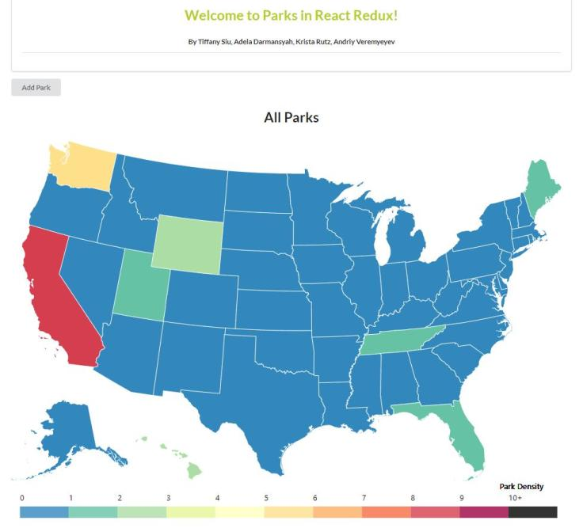
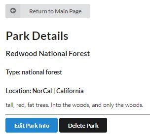
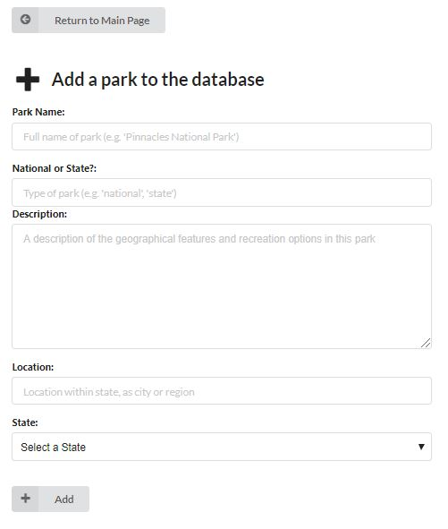
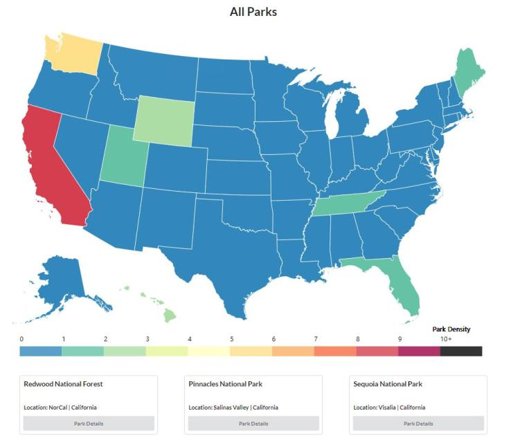

# _[Parks](https://github.com/ayohana/parks-redux)_

#### _React Redux with APIs Exercise, 05.11.2020 - 05.13.2020_

#### By _**Tiffany Siu, Adela Darmansyah, Krista Rutz, Andriy Veremyeyev**_

---
## Table of Contents
1. [Description](#description)
    - [Component Diagram/Wireframe](#component-diagram/wireframe)
2. [Setup/Installation Requirements](#setup/installation-requirements)
    - [Requirements to Run](#requirements-to-run)
    - [Instructions](#instructions)
    - [Other Technologies Used](#other-technologies-used)
3. [Notable Features](#notable-features)
4. [Specifications](#specifications)
    - [User Stories](#user-stories)
5. [Screenshots](#screenshots)
6. [Test Case Example](#test-case-example)
7. [Known Bugs](#known-bugs)
8. [Support and Contact Details](#support-and-contact-details)
9. [License](#license)
---
## Description

This is a front-end web application with full CRUD functionality. A user can view a list of all parks, add a new park, edit and delete an existing park. This application uses [ParkAPI](https://github.com/TSiu88/ParkAPI), a previously built C#/.NET API project, as the back-end that was deployed to [Azure](http://park-info-api.azurewebsites.net/index.html).  The project was deployed multiple times on Netlify when completed (links in Setup section).

This project also contains Redux Thunk middleware, a custom written logger middleware, uses the Fetch library, and uses D3.js data visualization.

For the back-end API, a user can add information and locations of parks found in the US. The parks can be stored with a name, type (national or state), description, location/city, and state. The database can be searched for these properties with the correct route structure. States can also be stored in another table in the database and also holds the number of parks that are within that state. The number of parks updates when parks are added, deleted, or modified.

### Component Diagram/Wireframe

## Setup/Installation Requirements

Follow the instructions below to run this project locally.

Otherwise, this project is also deployed on Netlify and ready-to-use from [Krista's repo](https://parks-api.netlify.app/), [Tiffany's repo](https://park-info-api.netlify.app/), [Adela's repo](https://final-react-week.netlify.app/), and [Andriy's repo](https://friendly-engelbart-8e49be.netlify.app/). We recommend using a **CORS blocker** app or [a Chrome extension like this](https://chrome.google.com/webstore/detail/cors-unblock/lfhmikememgdcahcdlaciloancbhjino?hl=en) to access the API, as the backend is not set to receive Cross-Origin requests, even when using our deployed sites.

### Requirements to Run

* _Web Browser_
* _Webpack_
* _Node.js_
* _NPM_
* _React_
* _Redux_

### Instructions

*This page may be viewed by:*

1. Download and install Node.js from the [official website](https://nodejs.org/en/download/)
2. Install [CORS Unblock](https://chrome.google.com/webstore/detail/cors-unblock/lfhmikememgdcahcdlaciloancbhjino?hl=en), a Chrome (or other browser) extension to prevent CORS errors.
3. Clone the [repository](https://github.com/ayohana/parks-redux.git) from my [GitHub page](https://github.com/TSiu88)
4. Use a command line/Bash to move to the project directory with `cd project-directory`
5. Run `npm install` to get all dependencies. 
6. Run `npm start` to start up the program 
7. Open [http://localhost:3000](http://localhost:3000) to view it in the browser and turn on **CORS Unblock** to see the site.

## Other Technologies Used
* _HTML_
* _CSS_
* _Javascript_
* _Redux Thunk_
* _Fetch Library_
* _Azure_
* _D3.js_
* _ESLint_
* _Babel_
* _Jest_
* _Markdown_ 
* _C#_
* _.NET API_
* _Netlify_
* _[CORS Unblock Browser Extension](https://chrome.google.com/webstore/detail/cors-unblock/lfhmikememgdcahcdlaciloancbhjino?hl=en)_
* _[Semantic UI](https://semantic-ui.com/)_
* _[D3 Library](https://github.com/d3/d3/wiki)_
* _[State Choropleth API](https://observablehq.com/@d3/state-choropleth)_

## Notable Features
The database for this project is deployed in Azure while the front end was built in React locally and is able to make calls to the deployed API to modify the database.  It has a D3.js data visualization map that is color coded to number of parks in the database that is located in that state with tooltips that pop up with mouseover.  The resulting application was also deployed using Netlify on multiple accounts.

## Specifications

  
Expand to view API Specifications

| Specification | Input | Output |
| :-------------     | :------------- | :------------- |
| The api displays a home screen with Swagger | Application start | Welcome screen displayed with all possible API calls |
| The api is able to show all parks when GET method is used | GET http://localhost:5000/api/parks | Displays all parks with info |
| The api is able to show all states when GET method is used | GET http://localhost:5000/api/states | Displays all states with info |
| The api is able to show all national or state parks (or other properties) when GET method is used with parameters | GET http://localhost:5000/api/parks?type={national/state} | Displays all national or state parks with info |
| The api is able to show all national or state parks (or other properties) when GET method is used with a general search | GET http://localhost:5000/api/parks/search | Displays all national or state parks with info matching search |
| The api is able to show 3 random parks when GET method | GET http://localhost:5000/api/parks/random | Displays 3 random parks with info |
| The api is able to show all parks for a state when GET method is used with multiple parameters | GET http://localhost:5000/api/parks?state={stateName}&type={national/state} | Displays all state parks for that state with info |
| The api is able to add parks with POST methods | POST http://localhost:5000/api/parks | Adds new park with provided info and increase count of parks for that state |
| The api is able to edit/update existing parks with PUT method | PUT http://localhost:5000/api/{id} | Update existing park with provided info and correct counts of parks for that state |
| The api is able to delete existing parks with DELETE method | DELETE http://localhost:5000/api/{id} | Delete park from database and decrease count of parks for that state |

### User Stories
<!-- 

  
Click to expand to view User Stories 
 -->

<!-- * As a scheduler, I want to be able to organize nurses vacation schedules without much paperwork so that I can be more efficient.
* As a scheduler, I want to see a list of requests with the overlapping dates and the nurses that sent in the requests organized by priority so I can see which staff member should have priority in getting the request approved. -->

<!-- * Give stories for people who will use this project and what they'd want it to do.  Can include customers/end users, programmers that maintain code, etc. Use "As a <job title/type of user/etc>, I want to...<what want program to achieve>... so that I can...<reason>.-->
<!-- 
 -->

## Screenshots

_Here is a snippet of what the homepage looks like:_

_Here is a preview of what the park details look like:_

  
Expand to view More Screenshots 

  _Here is a preview of what the park add form looks like:_

  

  _Here is a preview of what the D3.js data visualization map and park list looks like:_

  

## Test Case Examples
_Tests are done through Jest and are run from the command line prompt with `npm test`._

<!-- _Some example tests:_

 -->

<!-- _describe and show how to run tests with `code` examples}_ -->

## Known Bugs

Data Visualization requires refresh page to see most recent change to data
<!-- _There are currently no known bugs in this program_ -->

## Support and contact details

_If there are any question or concerns please contact us at our emails: [Tiffany Siu](mailto:tsiu88@gmail.com), [Adela Darmansyah](mailto:adela.yohana@gmail.com), [Krista Rutz](mailto:rutzkri000@gmail.com), and [Andriy Veremyeyev](mailto:belyybrat@gmail.com). Thank you._

### License

*This software is licensed under the MIT license*

Copyright (c) 2020 **_Tiffany Siu, Adela Darmansyah, Krista Rutz, Andriy Veremyeyev_**
