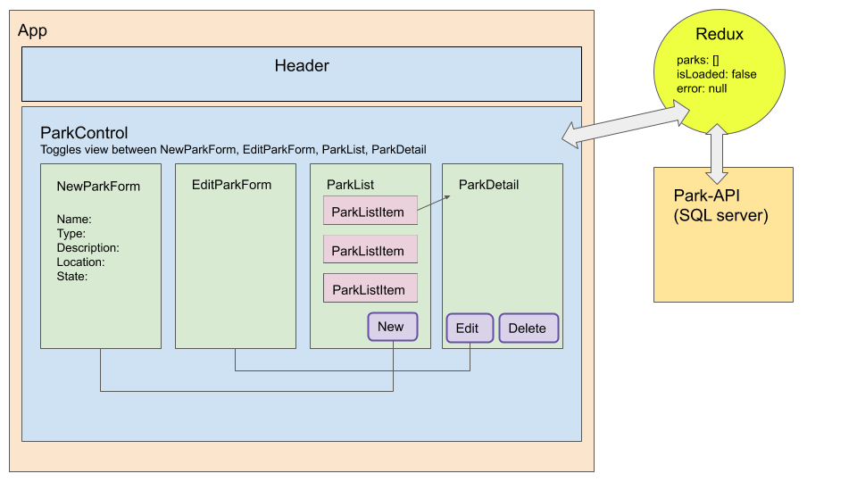

# _[Parks](https://github.com/ayohana/parks-redux)_

#### _React Redux with APIs Exercise, 05.11.2020 - 05.12.2020_

#### By _**Tiffany Siu, Adela Darmansyah, Krista Rutz, Andriy Veremyeyev**_

<!--  -->
<!--  -->

---
## Table of Contents
1. [Description](#description)
    - [Component Diagram/Wireframe](#component-diagram/wireframe)
    - [Database Structure](#database-structure)
2. [Setup/Installation Requirements](#setup/installation-requirements)
    - [Requirements to Run](#requirements-to-run)
    - [Instructions](#instructions)
    - [Other Technologies Used](#other-technologies-used)
3. [Notable Features](#notable-features)
4. [Specifications](#specifications)
    - [User Stories](#user-stories)
5. [Screenshots](#screenshots)
6. [Test Case Example](#test-case-example)
7. [Known Bugs](#known-bugs)
8. [Support and Contact Details](#support-and-contact-details)
9. [License](#license)
---
## Description

Used previous project [ParkAPI](https://github.com/TSiu88/ParkAPI) and deployed to [Azure](http://park-info-api.azurewebsites.net/index.html).

For this API, a user can add information and locations of parks found in the US.  The parks can be stored with a name, type (national or state), description, location/city, and state.  The database can be searched for these properties with the correct route structure.  States can also be stored in another table in the database and also holds the number of parks that are within that state.  The number of parks updates when parks are added, deleted, or modified.

_README under construction_
<!-- _Detailed desc w/ purpose/usage, what does, motivation to create, why exists, other info for users/developers to have_ -->

### Component Diagram/Wireframe

### Database Structure

<!--  -->

## Setup/Installation Requirements

### Requirements to Run
<!-- #### C#
* _.NET Core_
* _ASP.NET Core MVC_
* _MySQL Workbench_
* _MySQL Community Server_
* _Entity Framework_
* _Command Prompt_
* _Web Browser_ -->

* _Web Browser_
* _Webpack_
* _Node.js_
* _NPM_

### Instructions

*This page may be viewed by:*

1. Download and install Node.js from the [official website](https://nodejs.org/en/download/)
2. Install [CORS Unblock](https://chrome.google.com/webstore/detail/cors-unblock/lfhmikememgdcahcdlaciloancbhjino?hl=en), a Chrome (or other browser) extension to prevent CORS errors.
3. Clone the [repository](https://github.com/ayohana/parks-redux.git) from my [GitHub page](https://github.com/TSiu88)
4. Use a command line/Bash to move to the project directory with `cd project-directory`
5. Run `npm install` to get all dependencies. 
6. Run `npm run start` to start up the program 
7. Open [http://localhost:3000](http://localhost:3000) to view it in the browser.

## Other Technologies Used
* _HTML_
* _CSS_
* _Javascript_
* _React_
* _Redux_
* _Redux Thunk_
* _Fetch Library_
* _Azure_
* _Bootstrap 4.4.1_
* _ESLint_
* _Babel_
* _Jest_
* _Markdown_ 
* _C#_
* _.NET API_
* _[CORS Unblock Browser Extension](https://chrome.google.com/webstore/detail/cors-unblock/lfhmikememgdcahcdlaciloancbhjino?hl=en)_

## Notable Features
<!-- _features that make project stand out_ -->

## Specifications

<!-- * _List of features the program should do, from simplest to more complex, handling all possible cases.  Can do as text or put in table, with example input and output -->

  
Expand to view API Initial Specifications

| Specification | Input | Output |
| :-------------     | :------------- | :------------- |
| The api displays a home screen with Swagger | Application start | Welcome screen displayed with all possible API calls |
| The api is able to show all parks when GET method is used | GET http://localhost:5000/api/parks | Displays all parks with info |
| The api is able to show all states when GET method is used | GET http://localhost:5000/api/states | Displays all states with info |
| The api is able to show all national or state parks (or other properties) when GET method is used with parameters | GET http://localhost:5000/api/parks?type={national/state} | Displays all national or state parks with info |
| The api is able to show all national or state parks (or other properties) when GET method is used with a general search | GET http://localhost:5000/api/parks/search | Displays all national or state parks with info matching search |
| The api is able to show 3 random parks when GET method | GET http://localhost:5000/api/parks/random | Displays 3 random parks with info |
| The api is able to show all parks for a state when GET method is used with multiple parameters | GET http://localhost:5000/api/parks?state={stateName}&type={national/state} | Displays all state parks for that state with info |
| The api is able to add parks with POST methods | POST http://localhost:5000/api/parks | Adds new park with provided info and increase count of parks for that state |
| The api is able to edit/update existing parks with PUT method | PUT http://localhost:5000/api/{id} | Update existing park with provided info and correct counts of parks for that state |
| The api is able to delete existing parks with DELETE method | DELETE http://localhost:5000/api/{id} | Delete park from database and decrease count of parks for that state |

<!-- 

  
Click to expand to view Specifications

| Specification | Input | Output |
| :-------------     | :------------- | :------------- |
| The program displays welcome message and menu with prices | Application start | Welcome message and menu displayed |
| The program displays special deals in readable format | Application start | Special deals displayed ("Buy 2, get 1 free" "3 for $5") |
| The program takes input of user that is not an integer, then assume 0 ordered | Bread="aaa", Pastry="" | Bread=0, Pastry=0 |
| The program takes number of loaves of bread and pastries and displays totals | Bread=4, Pastry=4 | Bread=$20, Pastry=$8, Total=$28 |
| If input qualifies for special deals, costs calculated using discounted price | Bread=3, Pastry=3 | Bread=$10, Pastry=$5, Total=$15 |

 -->

### User Stories
<!-- 

  
Click to expand to view User Stories 
 -->

<!-- * As a scheduler, I want to be able to organize nurses vacation schedules without much paperwork so that I can be more efficient.
* As a scheduler, I want to see a list of requests with the overlapping dates and the nurses that sent in the requests organized by priority so I can see which staff member should have priority in getting the request approved. -->

<!-- * Give stories for people who will use this project and what they'd want it to do.  Can include customers/end users, programmers that maintain code, etc. Use "As a <job title/type of user/etc>, I want to...<what want program to achieve>... so that I can...<reason>.-->
<!-- 
 -->

## Screenshots

<!-- _Here is a snippet of what the input looks like:_

_Here is a preview of what the output looks like:_

 -->

<!-- 

  
Expand to view More Screenshots 

  

 -->

<!-- _{Show pictures using , show what library does as concisely as possible but don't need to explain how project solves problem from `code`_ -->

## Test Case Examples
<!-- _Tests are done through MSTest and are run from the command line prompt with `dotnet test` from the `ProjectName.Tests` directory. -->
<!-- _Tests are done through Jest and are run from the command line prompt with `npm test`._ -->

<!-- _Some example tests:_

 -->

<!-- _describe and show how to run tests with `code` examples}_ -->

## Known Bugs

_There are currently no known bugs in this program_

## Support and contact details

_If there are any question or concerns please contact us at our emails: [Tiffany Siu](mailto:tsiu88@gmail.com), [Adela Darmansyah](mailto:#), [Krista Rutz](mailto:rutzkri000@gmail.com), and [Andriy Veremyeyev](mailto:#). Thank you._

### License

*This software is licensed under the MIT license*

Copyright (c) 2020 **_Tiffany Siu, Adela Darmansyah, Krista Rutz, Andriy Veremyeyev_**
